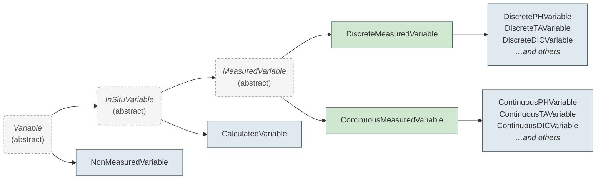

# Variables

Variables describe the individual measurements, calculations, or contextual data columns within a dataset. The OAE Data Protocol uses a class hierarchy to capture the different levels of metadata required for different kinds of variables — a directly measured pH value needs calibration and instrument details, while a calculated CO₂ variable needs the calculation method, and a contextual column like a station ID needs minimal metadata.

## Variable Hierarchy



This hierarchy aims to align with [NOAA-PMEL's OAPMetadata](https://github.com/NOAA-PMEL/OAPMetadata) XSD schema to make
interoperability easier between NOAA's OCADS system, and other repositories where OAE researchers may choose to host
their data, whether they be other ocean data repositories, and generalist repositories such as Zenodo.

## Choosing a Variable Type

Every variable requires three selections that determine which schema class is used:

### 1. Variable Type (`variable_type`)

What kind of measurement is this?

| Value | Description                | Examples |
|-------|----------------------------|---------|
| `pH` | pH measurement             | pH on total scale, NBS scale |
| `ta` | Total alkalinity           | TA from titration |
| `dic` | Dissolved inorganic carbon | DIC from coulometry |
| `co2` | CO₂ measurement variables  | pCO₂, fCO₂, xCO₂ |
| `sediment` | Sediment variable          | Sediment core measurements |
| `hplc` | HPLC pigments              | Chlorophyll, carotenoids |
| `other` | Generic variable           | Temperature, salinity, nutrients |
| `non_measured` | Contextual data            | Station ID, timestamps, coordinates |

### 2. Genesis (`genesis`)

How was this variable produced? (Not applicable for `non_measured`)

| Value | Description |
|-------|-------------|
| `measured` | Directly measured by an instrument |
| `calculated` | Derived from other variables (e.g., CO₂ from pH + DIC) |

### 3. Sampling (`sampling`)

How were measurements collected? (Only for `measured` genesis)

| Value | Description |
|-------|-------------|
| `discrete` | Bottle samples, grab samples |
| `continuous` | Autonomous sensors, underway systems |

### Selection → Schema Class Mapping

| variable_type | genesis | sampling | Schema Class |
|---------------|---------|----------|--------------|
| `pH` | `measured` | `discrete` | [DiscretePHVariable](../elements/DiscretePHVariable.md) |
| `pH` | `measured` | `continuous` | [ContinuousPHVariable](../elements/ContinuousPHVariable.md) |
| `ta` | `measured` | `discrete` | [DiscreteTAVariable](../elements/DiscreteTAVariable.md) |
| `ta` | `measured` | `continuous` | [ContinuousTAVariable](../elements/ContinuousTAVariable.md) |
| `dic` | `measured` | `discrete` | [DiscreteDICVariable](../elements/DiscreteDICVariable.md) |
| `dic` | `measured` | `continuous` | [ContinuousDICVariable](../elements/ContinuousDICVariable.md) |
| `co2` | `measured` | `discrete` | [DiscreteCO2Variable](../elements/DiscreteCO2Variable.md) |
| `sediment` | `measured` | `discrete` | [DiscreteSedimentVariable](../elements/DiscreteSedimentVariable.md) |
| `sediment` | `measured` | `continuous` | [ContinuousSedimentVariable](../elements/ContinuousSedimentVariable.md) |
| `hplc` | `measured` | `discrete` | [HPLCVariable](../elements/HPLCVariable.md) |
| `other` | `measured` | `discrete` | [DiscreteMeasuredVariable](../elements/DiscreteMeasuredVariable.md) |
| `other` | `measured` | `continuous` | [ContinuousMeasuredVariable](../elements/ContinuousMeasuredVariable.md) |
| Any except `non_measured` | `calculated` | — | [CalculatedVariable](../elements/CalculatedVariable.md) |
| `non_measured` | — | — | [NonMeasuredVariable](../elements/NonMeasuredVariable.md) |

## What Each Level Adds

### All Variables

Every variable has these basic fields:

- `schema_class` — identifies which class this variable is (auto-set)
- `variable_type` — the high-level classification
- `dataset_variable_name` — column header name in the data file
- `long_name` — full descriptive name
- `standard_identifier` — reference to a community vocabulary (e.g., NERC P01)

### InSituVariable (measured or calculated)

Adds project-acquired data fields:

- `units` (required)
- `genesis` — measured or calculated
- `method_reference` — citation for the method used
- `measurement_researcher` — the individual who measured/derived this parameter

### MeasuredVariable

Adds instrument and sampling fields:

- `sampling_method`, `analyzing_method` — how samples were collected and analyzed
- `sampling`, `observation_type` — discrete/continuous, profile/underway/etc.
- `analyzing_instrument` — instrument details with calibration
- QC fields: `uncertainty`, `qc_steps_taken`, `missing_value_indicators`

### CalculatedVariable

Adds calculation provenance:

- `calculation_method_and_parameters` — software, input variables, constants used

### Chemistry-Specific Classes

Each chemistry type (pH, TA, DIC, CO₂) adds specialized fields:

- **pH**: measurement temperature, temperature correction method, reported temperature, dye calibration
- **TA**: titration type, cell type, curve fitting method, CRM calibration
- **DIC**: CRM calibration, sample preservation
- **CO₂**: storage method, headspace volume, measurement temperature, gas detector calibration

## Example: pH Variable

```json
{
  "schema_class": "DiscretePHVariable",
  "variable_type": "pH",
  "genesis": "measured",
  "sampling": "discrete",
  "dataset_variable_name": "pH_total",
  "long_name": "pH on total scale at in-situ temperature",
  "units": "pH units",
  "sampling_method": "Niskin bottle",
  "analyzing_method": "Spectrophotometric, purified m-cresol purple",
  "observation_type": "profile",
  "measurement_temperature": "25",
  "ph_reported_temperature": "in-situ temperature"
}
```

## Example: Calculated Variable

```json
{
  "schema_class": "CalculatedVariable",
  "variable_type": "ta",
  "genesis": "calculated",
  "dataset_variable_name": "ta_calc",
  "long_name": "Total alkalinity calculated from salinity regression",
  "units": "umol/kg",
  "calculation_method_and_parameters": "Lee et al. 2006 salinity-TA relationship"
}
```

## Example: Contextual Variable

```json
{
  "schema_class": "NonMeasuredVariable",
  "variable_type": "non_measured",
  "dataset_variable_name": "expocode",
  "long_name": "Cruise expedition code"
}
```
