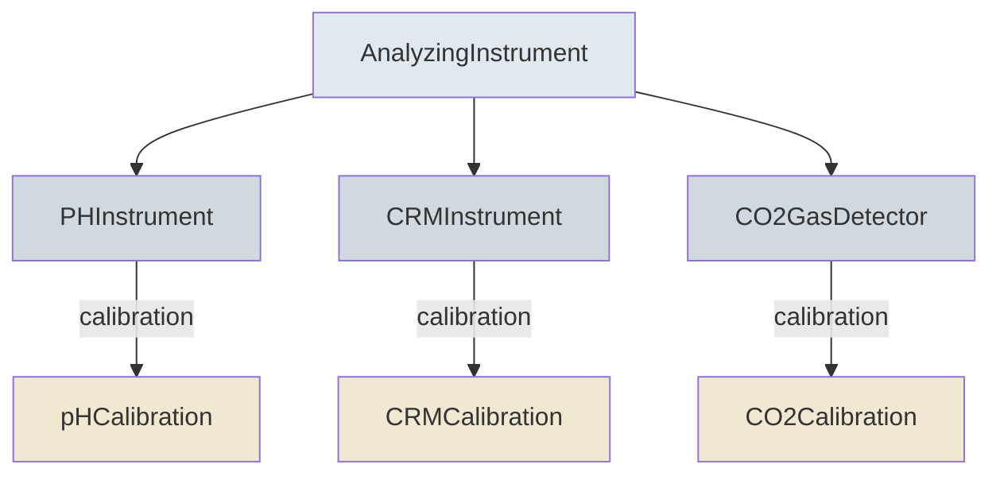

# Instruments & Calibration

Measured variables require metadata about the instruments used for analysis and their calibration history. The protocol uses a type-safe hierarchy: each chemistry-specific variable class is paired with an instrument type that enforces the correct calibration schema.

## Instrument Hierarchy



| Instrument | Used By | Calibration Type |
|-----------|---------|-----------------|
| `AnalyzingInstrument` | Generic measured variables | Base `Calibration` |
| `PHInstrument` | pH variables | `pHCalibration` (dye info) |
| `CRMInstrument` | TA and DIC variables | `CRMCalibration` (CRM batch info) |
| `CO2GasDetector` | CO₂ variables | `CO2Calibration` (standard gas info) |

## Calibration Fields

All calibrations share a common set of fields:

| Field | Description |
|-------|-------------|
| `technique_description` | How the instrument was calibrated |
| `calibration_location` | Factory, lab, or field |
| `frequency` | How often calibration is performed |
| `last_calibration_date` | Most recent calibration |
| `method_reference` | Citation for the calibration method |

### pH Calibration

Adds dye-specific fields for spectrophotometric pH measurement:

- Dye type and manufacturer
- Whether the dye was purified
- Correction method for unpurified dye
- pH of calibration standards

### CRM Calibration

Adds Certified Reference Material fields for TA and DIC:

- CRM manufacturer (e.g., Dickson lab)
- CRM batch number

### CO₂ Calibration

Adds standard gas fields for CO₂ gas detectors:

- Standard gas manufacturer, concentration, and uncertainty

## How Variables Link to Instruments

The `analyzing_instrument` field on measured variables is automatically constrained to the correct instrument type based on the variable class:

```json
{
  "schema_class": "DiscretePHVariable",
  "analyzing_instrument": {
    "instrument_type": "spectrophotometer",
    "manufacturer": "Agilent",
    "calibration": {
      "technique_description": "Tris buffer in synthetic seawater",
      "calibration_location": "lab",
      "dye_type_and_manufacturer": "Purified m-cresol purple, MCR Inc."
    }
  }
}
```
### Full Schemas
→ [AnalyzingInstrument](../AnalyzingInstrument.md) · [Calibration](../Calibration.md) · [PHInstrument](../PHInstrument.md) · [CRMInstrument](../CRMInstrument.md) · [CO2GasDetector](../CO2GasDetector.md)
