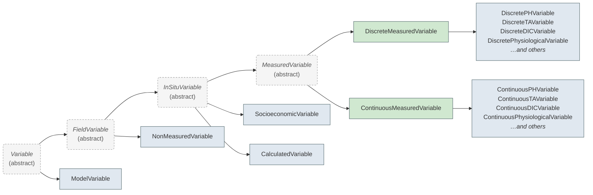

# Variables

Variables describe the individual measurements, calculations, or contextual data columns within a dataset. The OAE Data Protocol uses a class hierarchy to capture the different levels of metadata required for different kinds of variables — a directly measured pH value needs calibration and instrument details, while a calculated CO₂ variable needs the calculation method, and a contextual column like a station ID needs minimal metadata.

## Variable Hierarchy

This hierarchy aims to align with [NOAA-PMEL's OAPMetadata](https://github.com/NOAA-PMEL/OAPMetadata) XSD schema to make
interoperability easier between NOAA's OCADS system, and other repositories where OAE researchers may choose to host
their data, whether they be other ocean data repositories, and generalist repositories such as Zenodo.

## Choosing a Variable Type

Every variable in a **field dataset** requires three selections that determine which schema class is
used. Variables in a **model output dataset** skip this entirely — they are always
[ModelVariable](../ModelVariable.md) and are classified with the separate
[ModelVariableType](../ModelVariableType.md) enum. See [Model Output Variables](#model-output-variables) below.

### 1. Variable Type (`variable_type`)

What kind of measurement is this?

| Value | Description                | Examples |
|-------|----------------------------|---------|
| `pH` | pH measurement             | pH on total scale, NBS scale |
| `ta` | Total alkalinity           | TA from titration |
| `dic` | Dissolved inorganic carbon | DIC from coulometry |
| `co2` | CO₂ measurement variables  | pCO₂, fCO₂, xCO₂ |
| `sediment` | Sediment variable          | Sediment core measurements |
| `hplc` | HPLC pigments              | Chlorophyll, carotenoids |
| `physiological` | Physiological response | Organism growth rates, calcification |
| `socioeconomic` | Social/economic data   | Survey responses, ecosystem valuations |
| `other` | Generic variable           | Temperature, salinity, nutrients |
| `non_measured` | Contextual data            | Station ID, timestamps, coordinates |

### 2. Genesis (`genesis`)

How was this variable produced? (Not applicable for `non_measured`)

| Value | Description |
|-------|-------------|
| `measured` | Directly measured by an instrument |
| `calculated` | Derived from other variables (e.g., CO₂ from pH + DIC) |

### 3. Sampling (`sampling`)

How were measurements collected? (Only for `measured` genesis)

| Value | Description |
|-------|-------------|
| `discrete` | Bottle samples, grab samples |
| `continuous` | Autonomous sensors, underway systems |

### Selection → Schema Class Mapping

| variable_type | genesis | sampling | Schema Class |
|---------------|---------|----------|--------------|
| `pH` | `measured` | `discrete` | [DiscretePHVariable](../DiscretePHVariable.md) |
| `pH` | `measured` | `continuous` | [ContinuousPHVariable](../ContinuousPHVariable.md) |
| `ta` | `measured` | `discrete` | [DiscreteTAVariable](../DiscreteTAVariable.md) |
| `ta` | `measured` | `continuous` | [ContinuousTAVariable](../ContinuousTAVariable.md) |
| `dic` | `measured` | `discrete` | [DiscreteDICVariable](../DiscreteDICVariable.md) |
| `dic` | `measured` | `continuous` | [ContinuousDICVariable](../ContinuousDICVariable.md) |
| `co2` | `measured` | `discrete` | [DiscreteCO2Variable](../DiscreteCO2Variable.md) |
| `co2` | `measured` | `continuous` | [ContinuousCO2Variable](../ContinuousCO2Variable.md) |
| `sediment` | `measured` | `discrete` | [DiscreteSedimentVariable](../DiscreteSedimentVariable.md) |
| `sediment` | `measured` | `continuous` | [ContinuousSedimentVariable](../ContinuousSedimentVariable.md) |
| `hplc` | `measured` | `discrete` | [HPLCVariable](../HPLCVariable.md) |
| `physiological` | `measured` | `discrete` | [DiscretePhysiologicalVariable](../DiscretePhysiologicalVariable.md) |
| `physiological` | `measured` | `continuous` | [ContinuousPhysiologicalVariable](../ContinuousPhysiologicalVariable.md) |
| `socioeconomic` | `measured` | — | [SocioeconomicVariable](../SocioeconomicVariable.md) |
| `other` | `measured` | `discrete` | [DiscreteMeasuredVariable](../DiscreteMeasuredVariable.md) |
| `other` | `measured` | `continuous` | [ContinuousMeasuredVariable](../ContinuousMeasuredVariable.md) |
| Any except `non_measured` | `calculated` | — | [CalculatedVariable](../CalculatedVariable.md) |
| `non_measured` | — | — | [NonMeasuredVariable](../NonMeasuredVariable.md) |

## What Each Level Adds

### All Variables

Every variable has these basic fields:

- `schema_class` — identifies which class this variable is (auto-set)
- `variable_type` — the high-level classification
- `dataset_variable_name` — column header name in the data file
- `long_name` — full descriptive name
- `standard_identifier` — reference to a community vocabulary (e.g., NERC P01)

### InSituVariable (measured or calculated)

Adds project-acquired data fields:

- `units` (required)
- `genesis` — measured or calculated
- `method_reference` — citation for the method used
- `measurement_researcher` — the individual who measured/derived this parameter

### MeasuredVariable

Adds instrument and sampling fields:

- `sampling_method`, `analyzing_method` — how samples were collected and analyzed
- `sampling`, `observation_type` — discrete/continuous, profile/underway/etc.
- `analyzing_instrument` — instrument details with calibration
- QC fields: `uncertainty`, `qc_steps_taken`, `missing_value_indicators`

### CalculatedVariable

Adds calculation provenance:

- `calculation_method_and_parameters` — software, input variables, constants used

## Model Output Variables

Variables in a [ModelOutputDataset](../ModelOutputDataset.md) are described by a single class,
[ModelVariable](../ModelVariable.md), which sits directly under `Variable` — a sibling of
[FieldVariable](../FieldVariable.md) rather than a descendant of it, so a model variable is never
valid inside a `FieldDataset` and vice versa. Model output is produced by the simulation itself, so it carries none of the
sampling, instrument, calibration or in-situ QC metadata that field-collected variables do — how the
output was produced is already described by the simulation configuration on the parent dataset.

A `ModelVariable` therefore has only:

- `variable_type` — a [ModelVariableType](../ModelVariableType.md) value (required)
- `long_name`, `dataset_variable_name`, `units` (all required)
- `standard_identifier` — optional reference to a community vocabulary

`ModelVariableType` classifies the model output rather than selecting a schema class:

| Value | Description |
|-------|-------------|
| `air_sea_co2_flux` | Air-sea CO₂ flux |
| `dissolved_inorganic_carbon` | Dissolved inorganic carbon (DIC) |
| `total_alkalinity` | Total alkalinity (TA) |
| `temperature` | Temperature |
| `salinity` | Salinity |
| `ph` | pH of seawater |
| `biological_tracers` | Biological tracers — phytoplankton, chlorophyll, zooplankton, etc. biomass or concentration |
| `zonal_velocity` | Zonal velocity (u) |
| `meridional_velocity` | Meridional velocity (v) |
| `vertical_velocity` | Vertical velocity (w) |
| `co2` | CO₂ variables (xCO₂, pCO₂, fCO₂) |
| `other` | Any model output variable not covered above |

### Type-Specific Fields (Traits / Mixins)

Many measured variables (either discrete or continuous) inherit additional fields based on their `variable_type` that are
always present whether the specific variable is discrete or continuous. In these instances, we use LinkML's [mixin](https://linkml.io/linkml/schemas/inheritance.html#mixin-classes-and-slots)
feature to allow for trait-like composability of these fields into both the corresponding DiscreteVariable and
ContinuousVariable classes for that `variable_type`.

| Variable Type | Mixin                                                            |
|---------------|------------------------------------------------------------------|
| `pH` | [MeasuredPHFields](../MeasuredPHFields.md)                       |
| `ta` | [MeasuredTAFields](../MeasuredTAFields.md)                       |
| `dic` | [MeasuredDICFields](../MeasuredDICFields.md)                     |
| `co2` | [MeasuredCO2Fields](../MeasuredCO2Fields.md)                     |
| `sediment` | [MeasuredSedimentFields](../MeasuredSedimentFields.md)           |
| `physiological` | [MeasuredPhysiologicalFields](../MeasuredPhysiologicalFields.md) |
| `other` | —                                                                |

Leaf classes (e.g., [DiscretePHVariable](../DiscretePHVariable.md), [DiscreteTAVariable](../DiscreteTAVariable.md)) may
add further type-specific fields as well. For a comprehensive list of all required and optional fields please refer
to the individual class pages linked in the [mapping table](#selection-schema-class-mapping) above.
