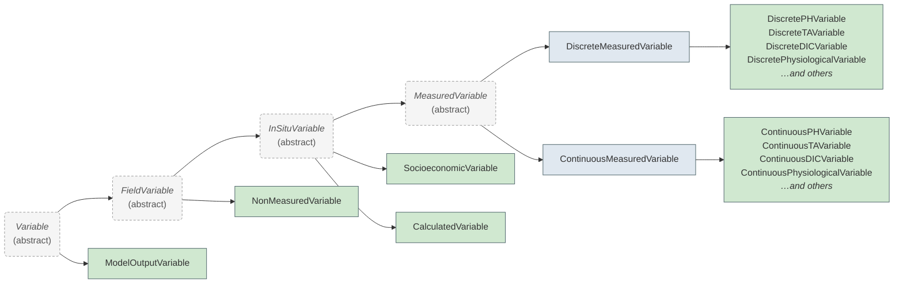

# Variables

Variables describe the individual measurements, calculations, or contextual data columns within a dataset. The OAE Data Protocol uses a class hierarchy to capture the different levels of metadata required for different kinds of variables — a directly measured pH value needs calibration and instrument details, while a calculated CO₂ variable needs the calculation method, and a contextual column like a station ID needs minimal metadata.

## Variable Hierarchy

```mermaid
graph LR
    V("`*Variable*
    (abstract)`")
    FV("`*FieldVariable*
    (abstract)`")
    ISV("`*InSituVariable*
    (abstract)`")
    MV("`*MeasuredVariable*
    (abstract)`")
    NMV["NonMeasuredVariable"]
    MOV["ModelOutputVariable"]
    SEV["SocioeconomicVariable"]
    CV["CalculatedVariable"]
    DM["DiscreteMeasuredVariable"]
    CM["ContinuousMeasuredVariable"]
    DPH["`DiscretePHVariable
    DiscreteTAVariable
    DiscreteDICVariable
    DiscretePhysiologicalVariable
    *…and others*`"]
    CPH["`ContinuousPHVariable
    ContinuousTAVariable
    ContinuousDICVariable
    ContinuousPhysiologicalVariable
    *…and others*`"]

    V --> FV
    V --> MOV
    FV --> NMV
    FV --> ISV
    ISV --> SEV
    ISV --> CV
    ISV --> MV
    MV --> DM
    MV --> CM
    DM --> DPH
    CM --> CPH

    classDef abstract fill:#f5f5f5,stroke:#999,stroke-dasharray: 4 3,color:#555
    classDef concrete fill:#e0e8f0,stroke:#4F656A
    classDef leaf fill:#d0e8d0,stroke:#4F656A
    class V,FV,ISV,MV abstract
    class DM,CM concrete
    class NMV,MOV,SEV,CV,DPH,CPH leaf
```

This hierarchy aims to align with [NOAA-PMEL's OAPMetadata](https://github.com/NOAA-PMEL/OAPMetadata) XSD schema to make
interoperability easier between NOAA's OCADS system, and other repositories where OAE researchers may choose to host
their data, whether they be other ocean data repositories, and generalist repositories such as Zenodo.

## Choosing a Variable Type

In a **field dataset**, three fields decide each variable's class. Variables in a **model output
dataset** use the
[ModelOutputVariable](../ModelOutputVariable.md) class and are classified with the separate
[ModelVariableType](../ModelVariableType.md) enum. See [Model Output Variables](#model-output-variables) below.

- **`variable_type`**: what kind of measurement it is. See [VariableType](../VariableType.md) for the
  values.
- **`genesis`**: whether it was `measured` by an instrument or `calculated` from other variables. Not
  used for `non_measured` variables.
- **`sampling`**: for measured variables, `discrete` (bottle or grab samples) or `continuous`
  (sensors, underway systems).

### Selection → Schema Class Mapping

| variable_type | genesis | sampling | Schema Class |
|---------------|---------|----------|--------------|
| `pH` | `measured` | `discrete` | [DiscretePHVariable](../DiscretePHVariable.md) |
| `pH` | `measured` | `continuous` | [ContinuousPHVariable](../ContinuousPHVariable.md) |
| `ta` | `measured` | `discrete` | [DiscreteTAVariable](../DiscreteTAVariable.md) |
| `ta` | `measured` | `continuous` | [ContinuousTAVariable](../ContinuousTAVariable.md) |
| `dic` | `measured` | `discrete` | [DiscreteDICVariable](../DiscreteDICVariable.md) |
| `dic` | `measured` | `continuous` | [ContinuousDICVariable](../ContinuousDICVariable.md) |
| `co2` | `measured` | `discrete` | [DiscreteCO2Variable](../DiscreteCO2Variable.md) |
| `co2` | `measured` | `continuous` | [ContinuousCO2Variable](../ContinuousCO2Variable.md) |
| `sediment` | `measured` | `discrete` | [DiscreteSedimentVariable](../DiscreteSedimentVariable.md) |
| `sediment` | `measured` | `continuous` | [ContinuousSedimentVariable](../ContinuousSedimentVariable.md) |
| `hplc` | `measured` | `discrete` | [HPLCVariable](../HPLCVariable.md) |
| `physiological` | `measured` | `discrete` | [DiscretePhysiologicalVariable](../DiscretePhysiologicalVariable.md) |
| `physiological` | `measured` | `continuous` | [ContinuousPhysiologicalVariable](../ContinuousPhysiologicalVariable.md) |
| `socioeconomic` | `measured` | — | [SocioeconomicVariable](../SocioeconomicVariable.md) |
| `other` | `measured` | `discrete` | [DiscreteMeasuredVariable](../DiscreteMeasuredVariable.md) |
| `other` | `measured` | `continuous` | [ContinuousMeasuredVariable](../ContinuousMeasuredVariable.md) |
| Any except `non_measured` | `calculated` | — | [CalculatedVariable](../CalculatedVariable.md) |
| `non_measured` | — | — | [NonMeasuredVariable](../NonMeasuredVariable.md) |

## What Each Level Adds

Each class adds fields to the one above it. The class pages list them in full.

- **[Variable](../Variable.md)**: what every variable has, such as its column name in the data file,
  a descriptive name and an optional reference to a community vocabulary.
- **[InSituVariable](../InSituVariable.md)**: data the project collected or derived: units, how it was
  produced and who produced it.
- **[MeasuredVariable](../MeasuredVariable.md)**: how samples were taken and analyzed, the analyzing
  instrument with its [calibration](../instruments-calibration/index.md), and quality control.
- **[CalculatedVariable](../CalculatedVariable.md)**: how the value was calculated, including software,
  inputs and constants.

## Model Output Variables

Variables in a [ModelOutputDataset](../ModelOutputDataset.md) are described by a single class,
[ModelOutputVariable](../ModelOutputVariable.md), which sits directly under `Variable` as a sibling of
[FieldVariable](../FieldVariable.md). `ModelOutputVariable`s carry none of the
sampling, instrument, calibration or in-situ QC metadata that field-collected variables do. How the
output was produced is described by the simulation configuration on the parent dataset.

## Type-Specific Fields (Mixins)

Many measured variables (either discrete or continuous) inherit additional fields based on their `variable_type` that are
always present whether the specific variable is discrete or continuous. In these instances, we use LinkML's [mixin](https://linkml.io/linkml/schemas/inheritance.html#mixin-classes-and-slots)
feature to allow for trait-like composability of these fields into both the corresponding DiscreteVariable and
ContinuousVariable classes for that `variable_type`.

| Variable Type | Mixin                                                            |
|---------------|------------------------------------------------------------------|
| `pH` | [MeasuredPHFields](../MeasuredPHFields.md)                       |
| `ta` | [MeasuredTAFields](../MeasuredTAFields.md)                       |
| `dic` | [MeasuredDICFields](../MeasuredDICFields.md)                     |
| `co2` | [MeasuredCO2Fields](../MeasuredCO2Fields.md)                     |
| `sediment` | [MeasuredSedimentFields](../MeasuredSedimentFields.md)           |
| `physiological` | [MeasuredPhysiologicalFields](../MeasuredPhysiologicalFields.md) |
| `other` | —                                                                |

Leaf classes (e.g., [DiscretePHVariable](../DiscretePHVariable.md), [DiscreteTAVariable](../DiscreteTAVariable.md)) may
add further type-specific fields as well. For a comprehensive list of all required and optional fields please refer
to the individual class pages linked in the [mapping table](#selection-schema-class-mapping) above.
