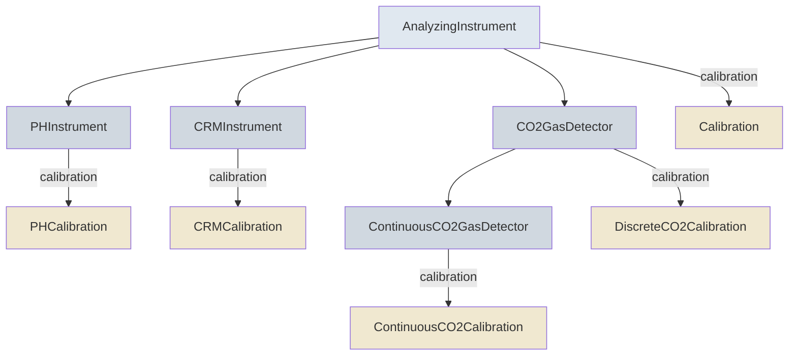

# Instruments & Calibration

Measured variables describe the instrument that analyzed them, in `analyzing_instrument`, and how that
instrument was calibrated. Some variable classes require a specific instrument type, and each
instrument type requires its own calibration type, so the right calibration fields come with the
variable.

## Instrument Hierarchy



## Which Instrument Each Variable Uses

| Variable class | Instrument | Calibration |
|----------------|------------|-------------|
| [DiscretePHVariable](../DiscretePHVariable.md) | [PHInstrument](../PHInstrument.md) | [PHCalibration](../PHCalibration.md): indicator dye |
| [DiscreteTAVariable](../DiscreteTAVariable.md), [DiscreteDICVariable](../DiscreteDICVariable.md) | [CRMInstrument](../CRMInstrument.md) | [CRMCalibration](../CRMCalibration.md): certified reference material |
| [DiscreteCO2Variable](../DiscreteCO2Variable.md) | [CO2GasDetector](../CO2GasDetector.md) | [DiscreteCO2Calibration](../DiscreteCO2Calibration.md): standard gases |
| [ContinuousCO2Variable](../ContinuousCO2Variable.md) | [ContinuousCO2GasDetector](../ContinuousCO2GasDetector.md) | [ContinuousCO2Calibration](../ContinuousCO2Calibration.md): standard gases |
| All other measured variables, including continuous pH, TA and DIC | [AnalyzingInstrument](../AnalyzingInstrument.md) | [Calibration](../Calibration.md) |

## Example

A discrete pH variable's `analyzing_instrument`:

<!-- validate: PHInstrument -->
```json
{
  "instrument_type": "spectrophotometer",
  "manufacturer": "Agilent",
  "accuracy": "0.001 pH units",
  "calibration": {
    "technique_description": "Tris buffer in synthetic seawater",
    "calibration_location": "lab",
    "dye_type_and_manufacturer": "Purified m-cresol purple, MCR Inc."
  }
}
```
