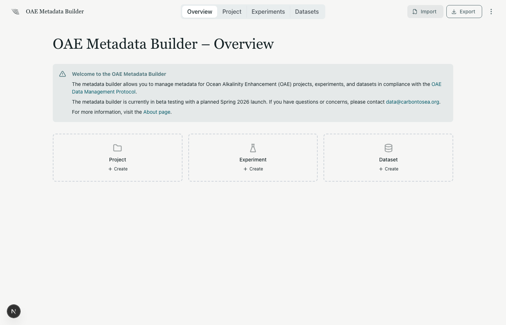
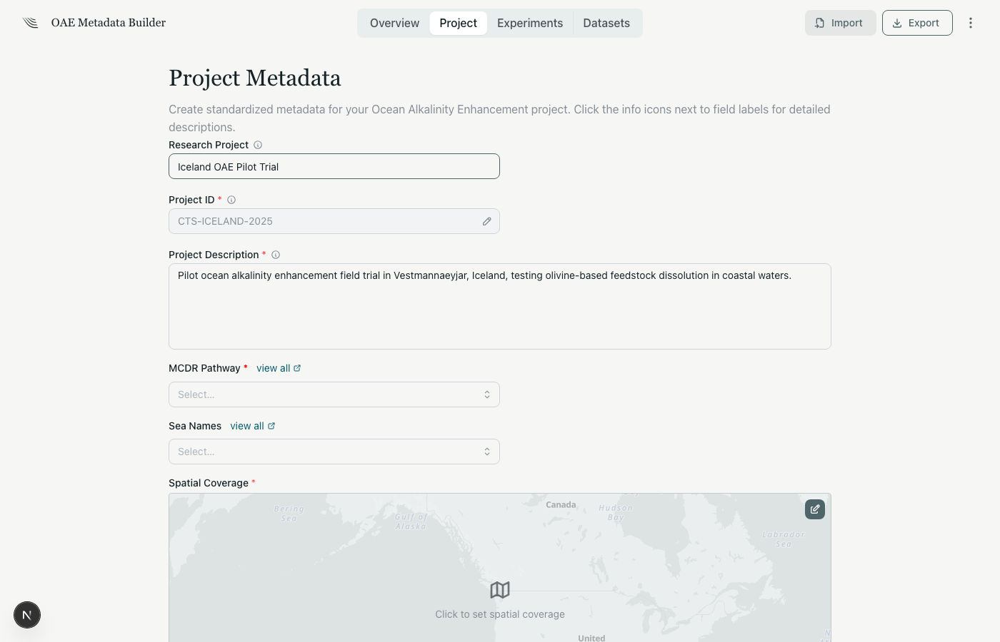
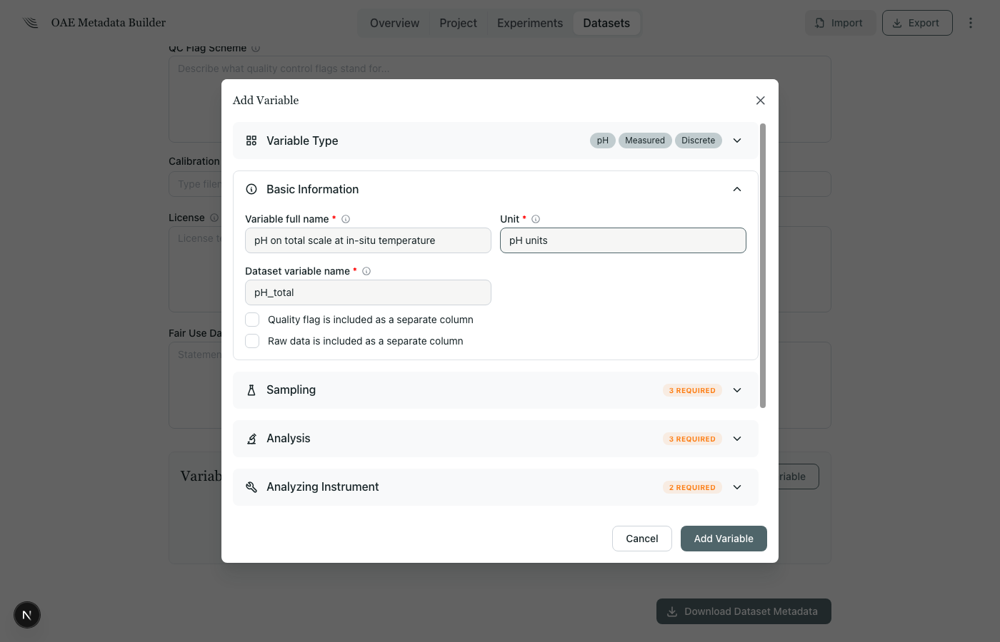

# OAE Metadata Builder

The **[OAE Metadata Builder](https://metadata.oaedata.org)** is a web application that guides you through creating protocol-compliant metadata. It renders form-based input for each section of the protocol and exports a valid JSON metadata file.

The builder walks you through:

1. **Project** — describe your OAE field trial, select your mCDR pathway, define spatial and temporal coverage
2. **Experiments** — create baseline, intervention, tracer, or model experiments with type-specific fields
3. **Datasets** — link data files to experiments, define platform information, and describe each variable in detail
4. **Export** — download a JSON metadata file ready for submission

### Project Metadata

The project form captures high-level information about your OAE field trial — project ID, description, geographic coverage with an interactive map, and principal investigator details.

### Variable Metadata

Each variable in a dataset is described through an accordion-style form. After selecting the variable type (e.g., pH), genesis (measured vs. calculated), and sampling method (discrete vs. continuous), the form expands to show type-specific fields for basic information, sampling details, analysis methods, instrument calibration, and quality control.

### Exporting & Importing

Click **Export** to download your metadata as a JSON file following the [Container format](metadata-format.md). You can export the full project or individual experiments and datasets.

Click **Import** to load a previously exported JSON file. The builder restores all project, experiment, dataset, and variable data, including the variable type selections and instrument configurations. The app also allows selective importing, where you can select individual experiments or datasets to import if you do not want to import the entirety of a metadata file into your session.
