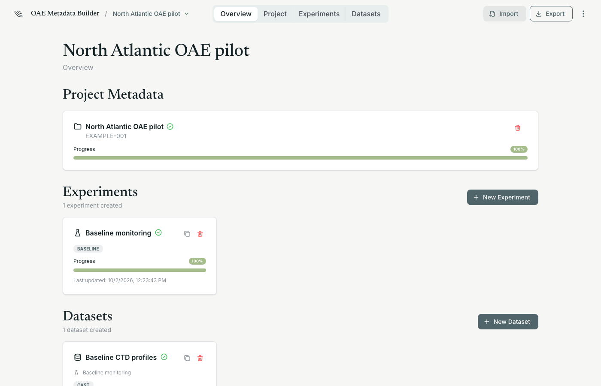

# OAE Metadata Builder

The **[OAE Metadata Builder](https://metadata.oaedata.org)** is a web app for writing metadata that
follows this schema. Its forms are generated from the schema's JSON Schema: one each for project,
experiment and dataset metadata, and a variable editor for each column in a dataset.

Projects are saved in your browser as you work. **Export** writes a [metadata file](metadata-format.md)
for the whole project or selected parts. **Import** reads a file back in, as a new project or merged
into the current one.

For a walkthrough, see the builder's [how-to guide](https://metadata.oaedata.org/how-to).
