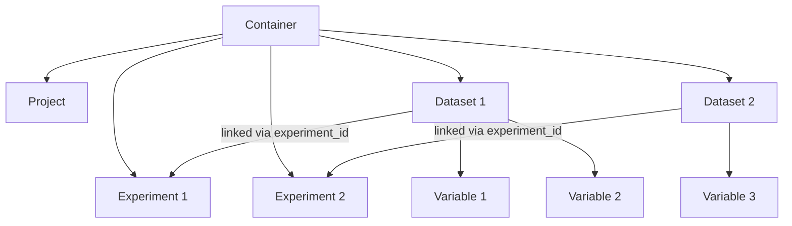

# Metadata File Format

The OAE Data Protocol uses **JSON** as its metadata format. Each metadata file is a self-contained document called a **Container** that holds all the metadata for a project, its experiments, and its datasets.

## The Container

A Container is the top-level object in every metadata file. It wraps project metadata, experiment metadata, and dataset metadata into a single document:

```json
{
  "@context": "https://schema.oaedata.org/context.jsonld",
  "version": "0.0.0-prerelease",
  "protocol_git_hash": "abc123...",
  "project": { ... },
  "experiments": [ ... ],
  "datasets": [ ... ]
}
```

| Field | Description |
|-------|-------------|
| `@context` | JSON-LD context URL — makes the file interpretable as linked data |
| `version` | Protocol schema version |
| `protocol_git_hash` | Git hash of the schema used to generate this file |
| `project` | A single [Project](Project.md) object |
| `experiments` | Array of [Experiment](Experiment.md) objects |
| `datasets` | Array of [Dataset](FieldDataset.md) objects |

!!! tip "Linked Data"
    The `@context` field is optional but recommended. It makes OAE metadata files valid [JSON-LD](https://json-ld.org/) documents, meaning they can be interpreted by linked data tools and semantic web infrastructure without any conversion. Standard JSON tools ignore the `@context` field, so it doesn't affect non-LD workflows.

## How the Pieces Relate



- A **Project** describes the overall OAE field trial or modeling effort
- **Experiments** are specific activities within a project (baseline measurements, interventions, tracer studies, model runs)
- **Datasets** contain the actual data files and their variable-level metadata
- Each dataset is linked to an experiment via `experiment_id`
- Each dataset contains an array of **Variables** describing the columns in the data file

## Example: Minimal Metadata File

```json
{
  "@context": "https://schema.oaedata.org/context.jsonld",
  "version": "0.0.0-prerelease",
  "protocol_git_hash": "50d3904c...",
  "project": {
    "project_id": "EXAMPLE-001",
    "description": "A pilot OAE field trial in the North Atlantic",
    "mcdr_pathway": "ocean_alkalinity_enhancement",
    "sea_names": ["http://vocab.nerc.ac.uk/collection/C16/current/23/"],
    "spatial_coverage": {
      "geo": { "box": "-70.0 40.0 -65.0 45.0" }
    },
    "temporal_coverage": "2025-01-01/2025-12-31"
  },
  "experiments": [
    {
      "experiment_id": "EXAMPLE-001-BASELINE",
      "experiment_types": ["baseline"],
      "description": "Baseline water chemistry prior to intervention",
      "spatial_coverage": {
        "geo": { "box": "-70.0 40.0 -65.0 45.0" }
      },
      "start_datetime": "2025-01-01T00:00:00Z",
      "end_datetime": "2025-06-30T23:59:59Z"
    }
  ],
  "datasets": [
    {
      "name": "Baseline CTD profiles",
      "experiment_id": "EXAMPLE-001-BASELINE",
      "description": "CTD cast data from baseline monitoring",
      "dataset_type": "cast",
      "data_product_type": "raw_sensor_data",
      "temporal_coverage": "2025-01-15/2025-06-15",
      "filenames": ["baseline_ctd_profiles.csv"],
      "variables": [
        {
          "schema_class": "ContinuousMeasuredVariable",
          "variable_type": "other",
          "dataset_variable_name": "temperature",
          "long_name": "Sea water temperature",
          "units": "degrees Celsius",
          "genesis": "measured",
          "sampling": "continuous"
        }
      ]
    }
  ]
}
```

## Creating Metadata

The easiest way to create a metadata file is with the **[OAE Metadata Builder](https://github.com/submarine-mrv/oae-metadata-builder)** — a web application that walks you through each section with form-based input and exports a valid Container JSON file.

You can also create metadata files programmatically using the [JSON Schema](https://github.com/submarine-mrv/oae-data-protocol/blob/main/project/jsonschema/oae_data_protocol.validation.schema.json) for validation.

## Validating Metadata

To validate a metadata file against the protocol schema:

```bash
# Using ajv-cli (Node.js)
npx ajv-cli validate \
  -s oae_data_protocol.validation.schema.json \
  -d your-metadata.json \
  --spec=draft2019 --strict=false
```

A [validation schema](https://github.com/submarine-mrv/oae-data-protocol/blob/main/project/jsonschema/oae_data_protocol.validation.schema.json) with full polymorphic support is also available for stricter validation of experiment and variable subclasses.

## JSON-LD Context

A [JSON-LD context](https://github.com/submarine-mrv/oae-data-protocol/blob/main/project/jsonld/context.jsonld) is published alongside the schema. Including it in your metadata file makes the document valid JSON-LD:

```json
{
  "@context": "https://schema.oaedata.org/context.jsonld",
  "version": "0.0.0-prerelease",
  ...
}
```

This enables linked data tools to interpret OAE metadata without conversion — field names resolve to URIs in the `https://schema.oaedata.org/` namespace, and community vocabulary references (NERC, QUDT) resolve to their canonical IRIs.

The `@context` field is ignored by standard JSON tools, so it doesn't affect existing workflows.
