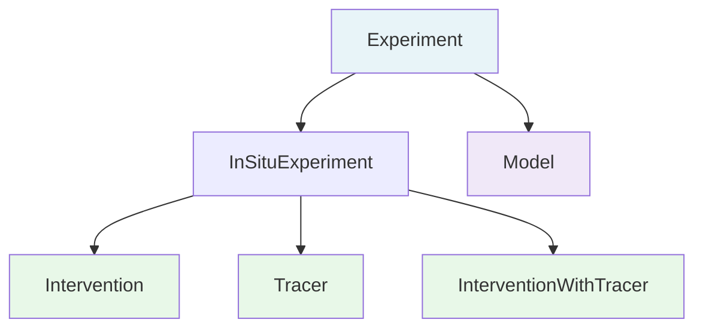

# Projects & Experiments

## Projects

A **Project** represents an OAE field trial, modeling effort, or research initiative. It captures the high-level context: who is conducting the work, where, and when.

Every metadata file has exactly one Project. All experiments and datasets within the file belong to this project.

**Key fields:**

| Field | Purpose |
|-------|---------|
| `project_id` | Unique identifier linking all project data |
| `mcdr_pathway` | The mCDR pathway (e.g., ocean alkalinity enhancement) |
| `sea_names` | NERC C16 sea name vocabulary references |
| `spatial_coverage` | Geographic bounding box |
| `temporal_coverage` | ISO 8601 time interval |
| `project_leads` | Principal investigators with ORCID identifiers |

→ [Full Project schema reference](../Project.md)

## Experiments

An **Experiment** is a specific activity within a project. OAE projects typically involve multiple experiments — for example, a baseline monitoring phase followed by an intervention.

### Experiment Types

The `experiment_types` field is multi-select. An experiment can have multiple types (e.g., both "intervention" and "tracer_study" for a combined deployment).

| Type | Schema Class | When to Use | Additional Fields |
|------|-------------|------------|-------------------|
| **Baseline** | [InSituExperiment](../InSituExperiment.md) | Pre-intervention monitoring | Standard in-situ fields |
| **Control** | [InSituExperiment](../InSituExperiment.md) | Reference measurements without intervention | Standard in-situ fields |
| **Intervention** | [Intervention](../Intervention.md) | Active alkalinity addition | Feedstock, dosing, equilibration details |
| **Tracer Study** | [Tracer](../Tracer.md) | Dye or gas tracer deployment | Tracer form, concentration, dosing |
| **Intervention + Tracer** | [InterventionWithTracer](../InterventionWithTracer.md) | Combined intervention with tracer (same dosing mechanism) | All intervention + tracer fields |
| **Model** | [Model](../Model.md) | Computational simulation | Model components, grid, configuration |
| **Other** | [InSituExperiment](../InSituExperiment.md) | Experiment type not covered above | Standard in-situ fields |

!!! note "When to use Intervention + Tracer"
    Only use the combined type when the alkalinity dosing and tracer dosing share the same underlying dosing mechanism or regimen. If they use separate delivery systems or schedules, create two separate experiments — one Intervention and one Tracer Study.

### Schema Selection Rules

When multiple experiment types are selected, the form renders the most inclusive schema:

- **Intervention + Tracer Study** → uses the combined `InterventionWithTracer` schema (all fields from both)
- **Model** is exclusive — cannot combine with other types. Create separate experiments for field work and modeling.

### Key Experiment Fields

All experiments share:

| Field | Purpose |
|-------|---------|
| `experiment_id` | Links datasets to this experiment |
| `experiment_types` | Multi-select classification |
| `spatial_coverage` | Geographic bounds of this experiment |
| `start_datetime` / `end_datetime` | UTC time range |
| `experiment_leads` | PIs for this experiment |

Intervention experiments add feedstock details, dosing information, and equilibration status. Tracer experiments add tracer form, concentration, and delivery details. Both share dosing location and delivery fields.

→ [Full Experiment schema reference](../Experiment.md)
