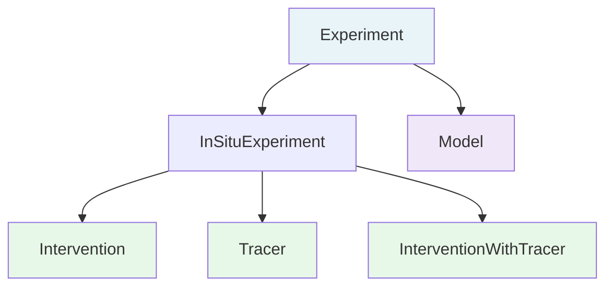

# Projects & Experiments

## Projects

A **[Project](../Project.md)** is an OAE field trial, modeling effort or research initiative: who is
doing the work, where and when. A metadata file has exactly one project, and every experiment and
dataset in it carries that project's `project_id`.

## Experiments

An **[Experiment](../Experiment.md)** is one activity within a project, such as a baseline monitoring
phase followed by an intervention. Each dataset names the experiment it came from with `experiment_id`.

### Experiment Types

```mermaid
graph TD
    E[Experiment] --> ISE[InSituExperiment]
    E --> M[Model]
    ISE --> I[Intervention]
    ISE --> T[Tracer]
    ISE --> IWT[InterventionWithTracer]

    style E fill:#e8f4f8
    style M fill:#f0e8f8
    style I fill:#e8f8e8
    style T fill:#e8f8e8
    style IWT fill:#e8f8e8
```

| Type | Schema Class | When to Use |
|------|-------------|------------|
| **Baseline** | [InSituExperiment](../InSituExperiment.md) | Pre-intervention monitoring |
| **Control** | [InSituExperiment](../InSituExperiment.md) | Reference measurements without intervention |
| **Intervention** | [Intervention](../Intervention.md) | Active alkalinity addition |
| **Tracer Study** | [Tracer](../Tracer.md) | Dye or gas tracer deployment |
| **Intervention + Tracer** | [InterventionWithTracer](../InterventionWithTracer.md) | Combined intervention with tracer (same dosing mechanism) |
| **Model** | [Model](../Model.md) | Computational simulation |
| **Other** | [InSituExperiment](../InSituExperiment.md) | Experiment type not covered above |

!!! note "When to use Intervention + Tracer"
    Only use the combined type when the alkalinity dosing and tracer dosing share the same underlying dosing mechanism or regimen. If they use separate delivery systems or schedules, create two separate experiments — one Intervention and one Tracer Study.

### Combining Types

`experiment_types` can hold several values, and the combination decides which class describes the
experiment:

- **Intervention** and **Tracer Study** together use
  [InterventionWithTracer](../InterventionWithTracer.md), which has the fields of both. See the note
  above on when to combine them.
- **Model** experiments use [Model](../Model.md), which has none of the in-situ fields. Describe field
  work and modeling as separate experiments.
- **Baseline**, **Control** and **Other** on their own use [InSituExperiment](../InSituExperiment.md).
